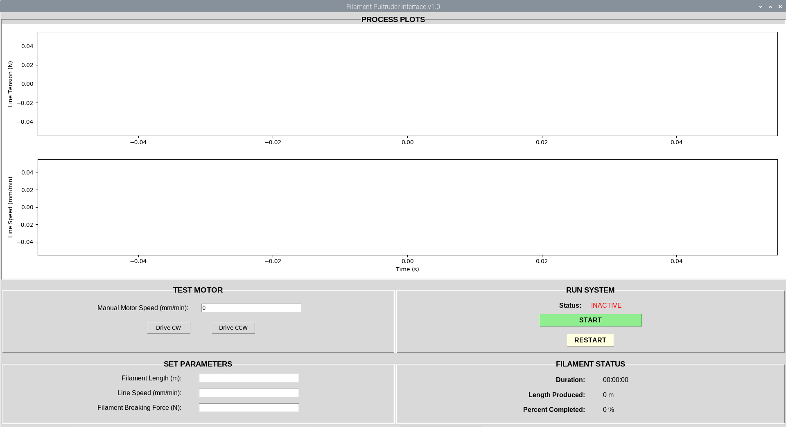

# Filament Pultruder GUI

**Authors:** Aron Saengchan

### Summary
A user-friendly graphical user interface for a filament pultruder device, developed on Python using the Tkinter library. This device is designed to convert commingled yarns into continuous fibre-reinforced polymer composite filament for 3D printing.

### Images

	

 
This project was completed during my research position at the Laboratory of Engineering Materials at the University of Calgary.

